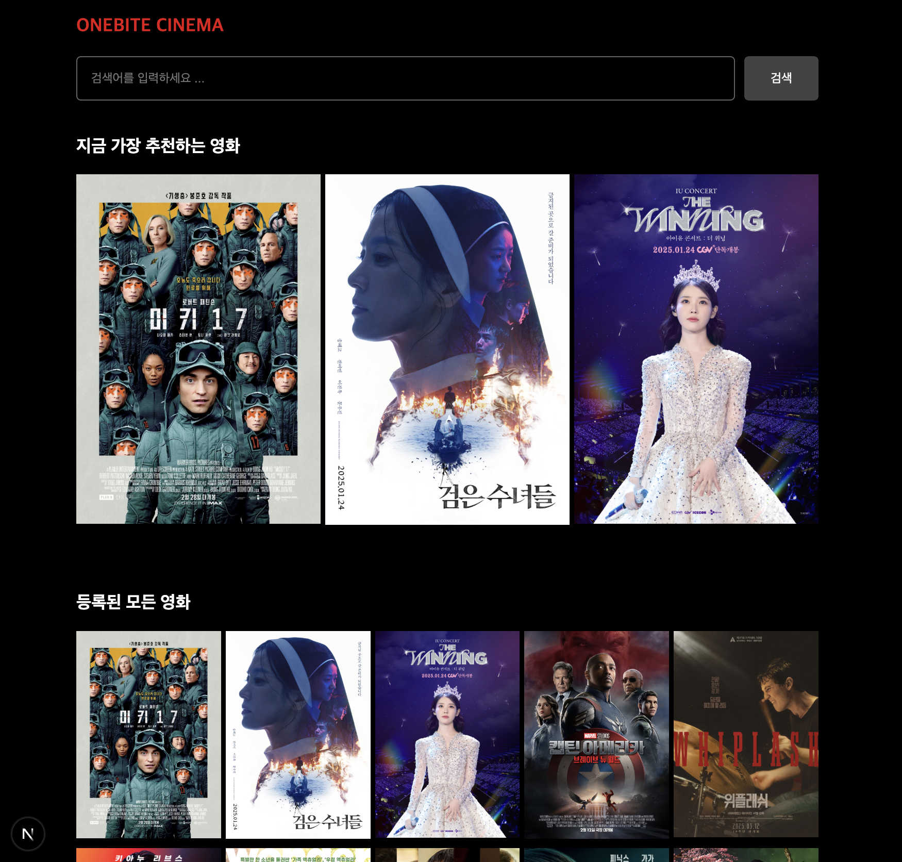
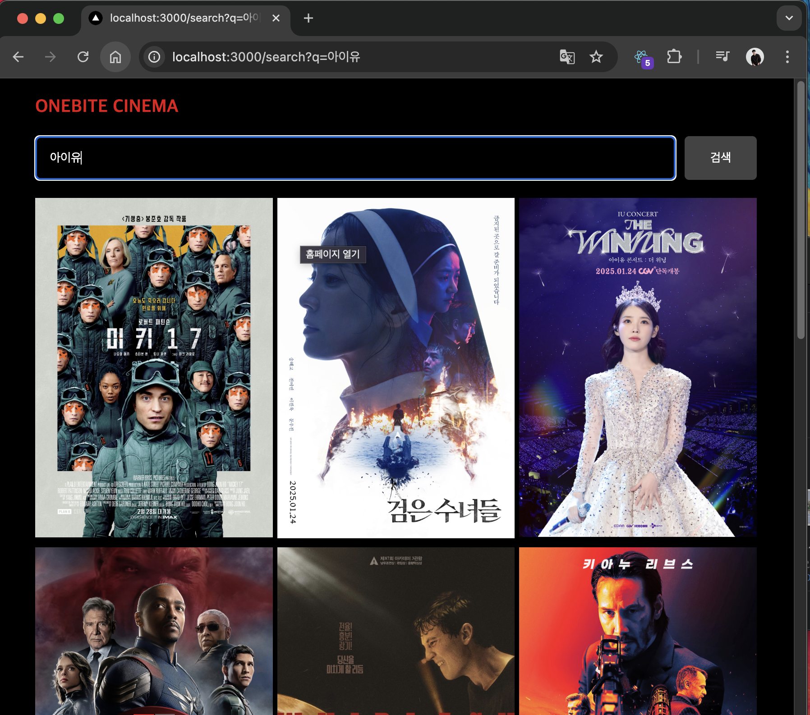
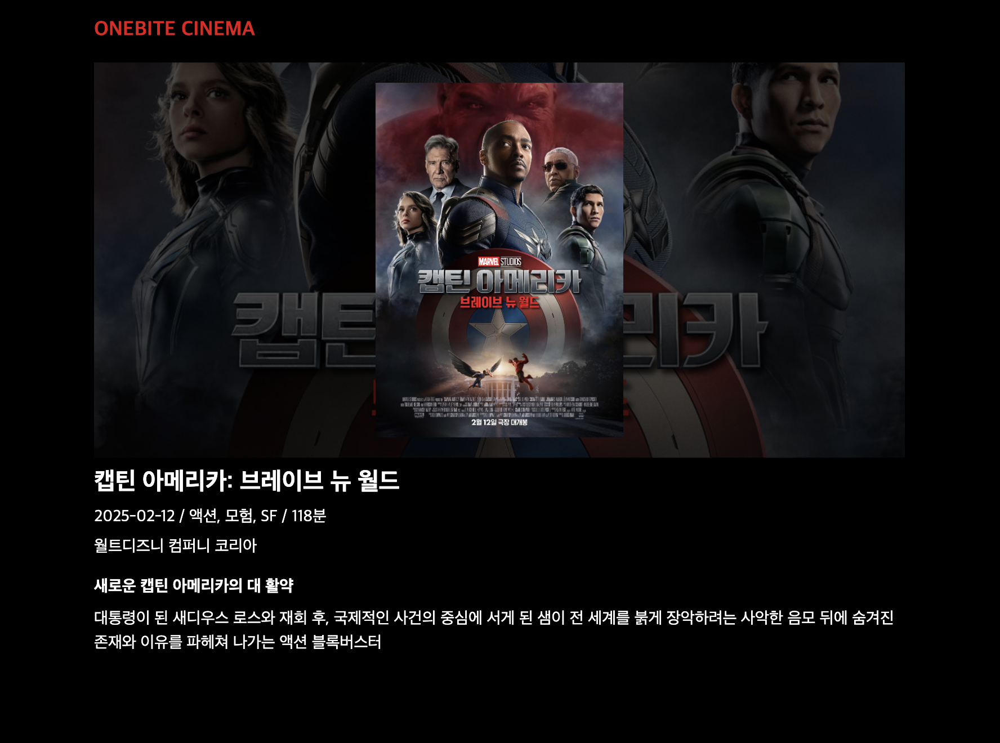

## 미션) 한입-씨네마 UI 구현하기

"한입 씨네마" 프로젝트의 UI를 미리 구현합니다.

## 미션 제출 방법

미션 제출은 다음 방법중 하나를 선택하시면 됩니다.

1. 결과 화면 캡쳐
   - 페이지 결과물만 주소와 함께 캡쳐하시거나 프로젝트 파일 구조를 함께 캡쳐해주세요
   - 여러장 올리셔도 됩니다!
2. GitHub에 프로젝트 업로드 후 링크로 공유

> [정답 보기](https://github.com/winterlood/onebite-next-challenge/blob/main/missions/day11/mission/answer)

## 미션 소개) 한입-씨네마 UI 구현하기

본격적인 기능 구현에 앞서 **한입 씨네마** 프로젝트의 UI를 미리 구현합니다.  
아래 안내드리는 순서에 따라 미션을 수행해주세요

> Tip 1. Page Router 버전으로 이미 만들어두셨던 컴포넌트, CSS 파일들을 복사-붙여넣기 하시면 편할거에요! App Router 버전에서의 차이점에 대해서만 느껴보세요 😃

> Tip 2. 혹시 과제 수행이 너무너무 귀찮으시다면 딱 오늘 미션만큼은 정답 코드를 그대로 클론하셔도 됩니다! 인증만 올려주세요

> 요구사항만 만족한다면 UI를 구현하는 방식은 자유입니다. 결과물만 비슷하게 만족하면 됩니다.  
> 스타일의 변경을 원하시는 분들께서는 자유롭게 상상력을 발휘하셔도 괜찮습니다.  
> 요구사항을 일부 변경하셔도 괜찮습니다 (리스트에서 아이템의 개수 등)

### 0. 더미데이터 설정하기

이번 미션에서는 아래 그림과 같이 실제 영화 데이터를 렌더링하는 UI를 구현해야 합니다.  
그러나 우리는 아직 API를 통해 데이터를 불러오는 방법에 대해 살펴보지 않았으므로  
일단 JSON 형식의 더미 데이터를 활용해야 합니다.


아래 링크로 이동하셔서 데이터를 복사하신 다음 여러분의 Next 앱에 dummy.json등의 이름으로 저장해주세요
(강의에서 설명드렸던 더미 데이터를 설정하는 방법과 동일합니다!)

https://github.com/winterlood/onebite-next-challenge/blob/main/missions/day11/mission/answer/src/dummy.json

### 1. 타입 설정하기

더미 데이터 설정을 마쳤다면 다음으로는 이 더미데이터를 우리 프로젝트에서 활용하기 위한 타입을 정의해야 합니다.  
src/types.ts 파일을 만든 다음 다음과 같이 MovieData 타입을 정의하고 내보내세요

```TypeScript
export interface MovieData {
  id: number;
  title: string;
  subTitle: string;
  description: string;
  releaseDate: string;
  company: string;
  genres: string[];
  runtime: number;
  posterImgUrl: string;
}
```

여기까지 설정해 주셨다면 이제 밑 준비는 모두 마무리 되었습니다.  
이제 페이지 UI와 각 페이지에 필요한 컴포넌트들을 구현할 차례에요!

### 2. 인덱스 페이지 UI 구현

인덱스(/) 페이지의 UI 요구사항은 다음과 같습니다.

- 검색바 레이아웃이 적용되어야 합니다.
- **"지금 가장 추천하는 영화"** 섹션과 **"등록된 모든 영화"** 섹션이 존재합니다.
  - **"지금 가장 추천하는 영화"** 섹션에는 아래 그림처럼 3개의 **MovieItem 컴포넌트**가 렌더링 됩니다.
  - **"등록된 모든 영화"** 섹션에는 아래 그림처럼 한줄에 5개의 **MovieItem 컴포넌트**가 렌더링 됩니다.
- **MovieItem 컴포넌트**를 클릭하면 `~/movie/[id]` 경로로 이동합니다.
- MovieItem은 더미 데이터를 사용합니다.



### 3. 서치 페이지 UI 구현

서치(/search) 페이지의 UI 요구사항은 다음과 같습니다.

- 검색바 레이아웃이 적용되어야 합니다.
- 검색 결과로 **MovieItem 컴포넌트**가 한줄에 3개씩 렌더링 됩니다.
  - 현재는 데이터가 없기 때문에 더미 데이터를 렌더링 하면 됩니다.
- MovieItem 컴포넌트를 클릭하면 `~/movie/[id]` 경로로 이동합니다.
- MovieItem은 더미 데이터를 사용합니다.



### 4. 상세 페이지 UI 구현

영화 상세 페이지(movie/[id])의 UI 요구사항은 다음과 같습니다.

- 한입 북스의 도서 상세 페이지와 유사하게 만들면 됩니다.
- 아래 그림처럼 posterImgUrl, title, releaseDate, genres, runtime, company, subTitle, description 필드의 값을 렌더링 하면 됩니다.
- 스타일은 원하시는대로 자유롭게 설정하셔도 됩니다.
- dummy.json에 저장된 하나의 영화 데이터를 활용합니다.


